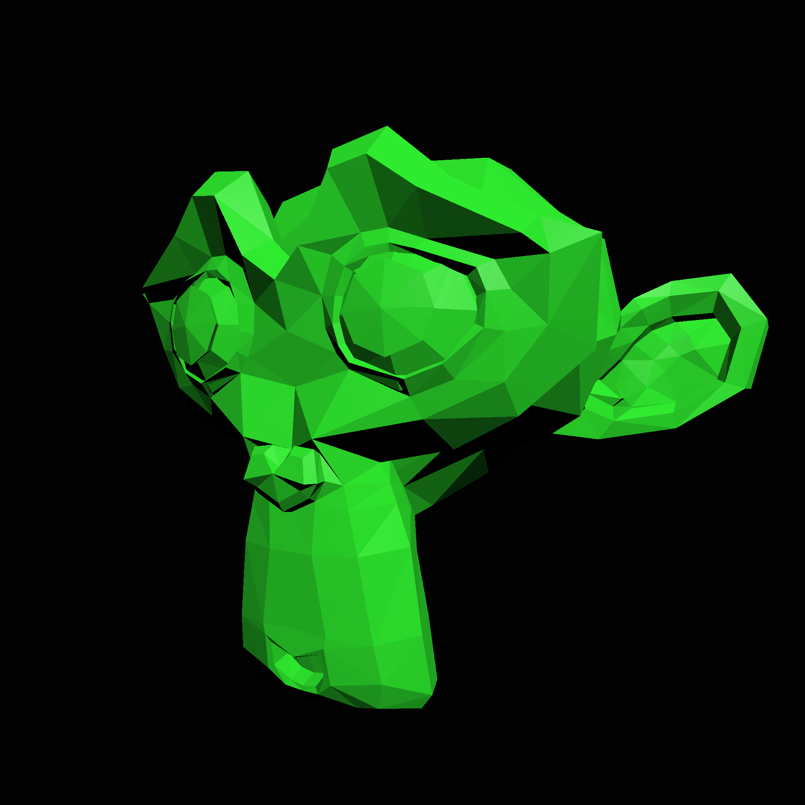

Softrender
==========

WIP Software Renderer in Rust

## Under rewrite

I'm currently rewriting the library for increased performance and features, 
so I ask you be patient with me.

Currently, the following features are implemented:

* Shading Pipeline
    - Type-based primitives for compile-time handling of varying mesh primitives
        * That is to say, using types and their associated functions instead of a `match` statement for the primitive type.
* Vertex Shader
    - Processes all vertices in parallel
* Geometry Shader
    - Supports Points, Lines and Triangles generated by the geometry shader. 
    - Replace-only variation for now, which is analogous to an OpenGL Geometry Shader.
    - Processes all primitives in parallel.
* Clipping
    - Clipping is implemented using the geometry shader
    
What is not completed:

* Tile-based triangle rasterizer

The old rasterizer generated multiple full-sized framebuffers for each thread and rendered a portion of the triangles to it, then
merged the partial framebuffers together into the final framebuffer. This was slow because leveraging rayon's iterators and a fixed number of
full-sized framebuffers was a pain.

Instead, the framebuffer is split up into smaller chunks, or tiles, which are rendered in parallel. There is a lot of room for optimization with this method,
and it should scale very well. With a tile-based approach, we render all triangles on all threads, so the data doesn't have to be split up at all.
Modern NVidia GPUs (and AMD I think), plus most large raytracers, prefer this approach for the same reasons.

Line primitives will most likely be rendered with tiles, too, by using Bresenham's algorithm or Xiaolin Wu's algorithm and simply calculating their intersections
with the tile bounding box for each tile, and rendering only part of the line. Since Xiaolin Wu's algorithm can handle fractional pixel locations, this shouldn't
cause any shearing or other artifacts for lines. Because lines will be clipped to the tile bounding box, 
they are implicitely clipped to the viewport in screen-space.

Point primitives are even simpler, since if they aren't in the tile bounding box they are just skipped.

* Additional Geometry Shader functionality

I would like to implement two additional geometry shader methods for modify/append and append-only operations,
which will allow varying degrees of performance improvements for some applications.

[Documentation](https://docs.rs/softrender/)

### Example:

#### Complex, full example ~450 LOC

See the [Full Example](/full_example/) for more info on the above.

#### Simple, single file example ~200 LOC
