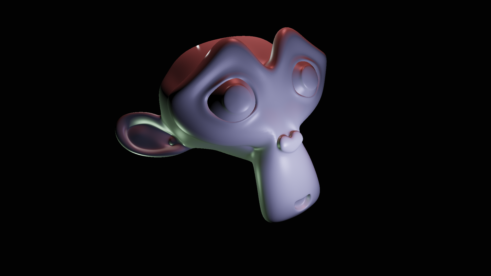

softrender example project
==========================

A relatively simple project demonstrating softrender's usage of meshes, uniforms, shaders and so forth.

The shading is done with simple Lambertian diffuse and Blinn-Phong specular reflections of points lights.